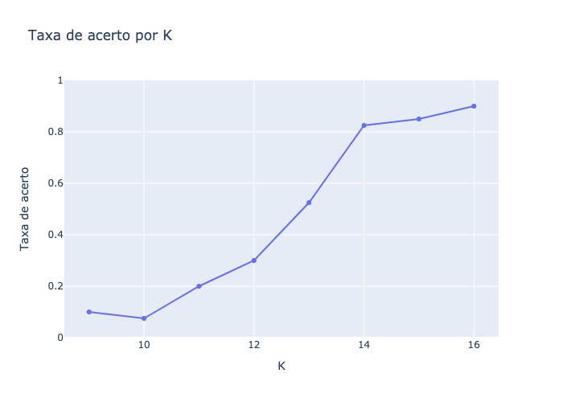
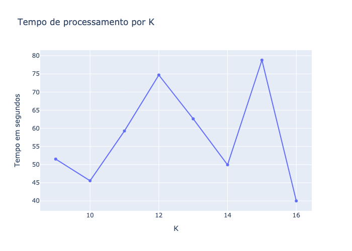

# lzw-pattern-recognizer

🗜 Implementation of the second project of intro to Information theory at UFPB, plugging an LZW compressor to K-neighboors algorithm

## Equipe

[Lucas Moreira](https://github.com/lucasmsa),
[Marismar Costa](https://github.com/marismarcosta),
[Gustavo Eraldo](https://github.com/gustavoeraldo)

## Introdução

O presente trabalho implementa um reconhecedor de padrões utilizando o **k-vizinhos** (algoritmo de classificação), sendo este baseado no **LZW** (algoritmo de compressão).

## Metodologia

Para desenvolvimento do projeto, foi utilizado a base de dados [**ORL Database of Faces**](https://www.dropbox.com/s/mnhfhb1i51loknk/orl_faces.zip?dl=0),
que contém dados de 40 pessoas, cada uma com 10 imagens de sua face.

Em geral, para a implementação do projeto, o cabeçalho do arquivo de dados foi descartado e a linguagem de programação utilizada foi Python.

O banco foi organizado de forma que houvesse diferentes amostras de treino e classificação utilizando a **técnica de validação cruzada**. Dessa forma, a imagem de classificação foi obtida de forma aleatória, as utilizadas para treinamento são todas as outras que não são de classificação. De modo geral, 360 imagens foram utilzadas para treino e 40 para classificação, dado que o banco tem 40 pessoas e 10 imagens por pessoa, resultou em 1 imagem para classificação e 9 para treinamento por pessoa.

Na etapa de treinamento, foi gerado um modelo **LZW** (dicionário) para cada categoria (ou seja, pessoa) da base de dados.

Para classificação, o **dicionário permaneceu estático** durante todo o processo, sendo a **quantidade de indíces** do dicionário utilizada como métrica de distância.

Durante os testes, utilizou-se o intervalo de variação **9 a 16** para o valor de **k**.

## Análise de resultados

No Gráfico 1, é apresentado a curva da **razão de acerto** em função da variação do **k** resultante da aplicação do algoritmo.

<figure>
  
  <figcaption>Gráfico 1 - Razão de acerto por K</figcaption>
</figure>

É possível perceber que a taxa de acerto da classificação aumenta em função do incremento de **k**. Este comportamento condiz com o esperado, visto que quanto maior for o dicionário, mais abrangente este será e consequentemente mais preciso.

O Gráfico 2 é referente a curva do **tempo de processamento** do código em função da variação do **k**.

<figure>
    
    <figcaption>Gráfico 2 - Tempo de processamento por K</figcaption>
</figure>

A curva de tempos de processamento por **k** não apresentou um padrão bem definido. De modo geral, os valores obtidos ficaram entre **40s** e **80s**, sendo a média aproximadamente de **58s**.

## Considerações finais

O trabalho desenvolvido permitiu uma expansão dos conhecimentos abordados em sala de aula, além da visão prática da teoria discutida por autores da literatura.

## Execução do código

Execute no terminal o seguinte comando:

```.bash
python lzw_pattern_recognizer.py
```
